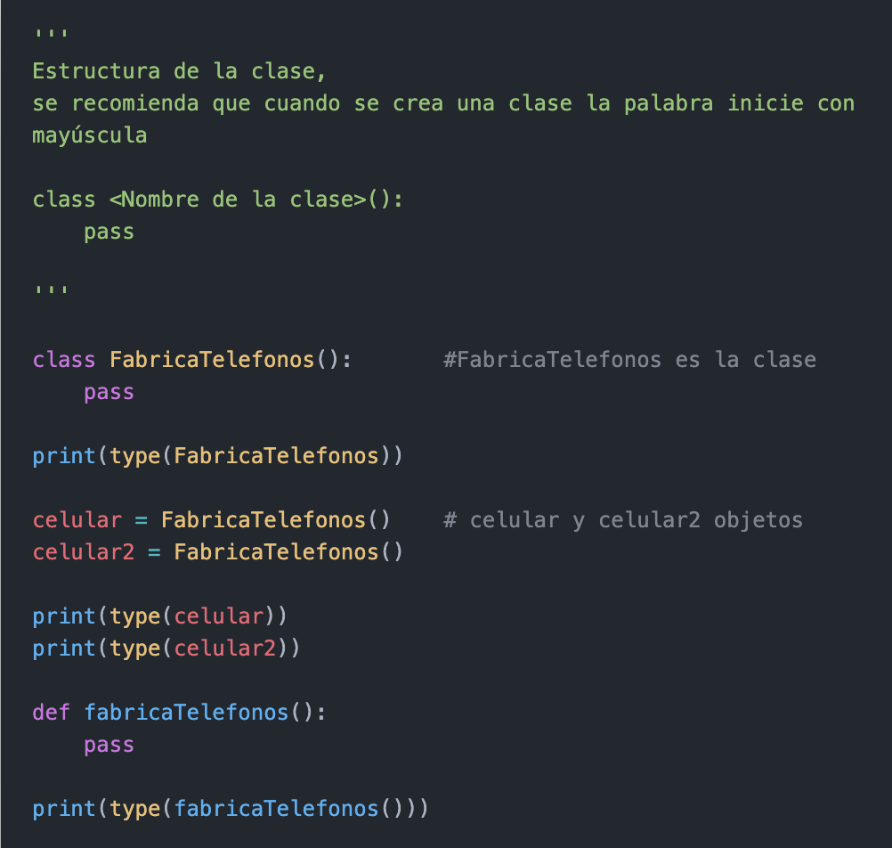

# ***Clases***
### Las clases son un molde que sirve para crear un objeto. La clase es similar a un plano (blueprint) de una casa.

### El cual cuanta con todos los detalles de las dimensiones, puertas, ventanas, pisos, etc. Estos planos nos ayudan a construir una casa.

### Estructura de una clase
    class <Nombre de la clase>():
        pass

##### Nota: ***pass*** es una operacion nula, es decir cuando se ejecuta, nada sucede.

# ***Objetos***
### Un objetos, es creado a partir de una clase. El proceso de creación del objeto se denomina instantiation.

### Salida:
- <class 'type'>
- <class '__main__.FabricaTelefonos'>
- <class '__main__.FabricaTelefonos'>
- <class 'NoneType'>

#
|  | Descripción |
|-----:|---------------|
|  | ***Documentación oficial*** |
|  | ***Ejemplo*** |

## Puedes seguir y apoyar mi trabajo haciendo click en "☆ Star" y en el botón de Follow.
## ¡Muchas gracias, bienvenido!!!

## Contacto y apoyo:

 
 

