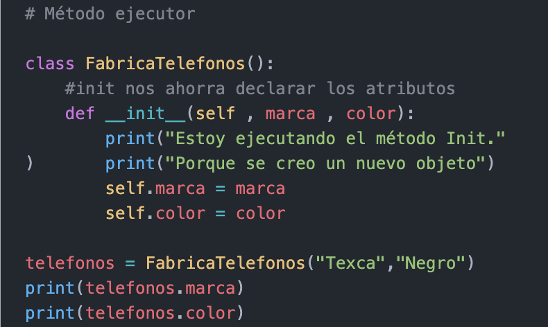

# Método ***_ _ init _ _ ()***

### El método _ _ _init_ _ _() es un método especial, el cual se ejecuta al momento de instanciar un objeto. El comportamiento de _ _ _init_ _ _() es muy similar a los «constructores» en otros lenguajes. Los argumentos que se utilizan en la definición de _ _ _init_ _ _() corresponden a los parámetros que se deben ingresar al instanciar un objeto.

### Salida:

- Estoy ejecutando el método Init.
- Porque se creo un nuevo objeto
- Texca
- Negro

#
|  | Descripción |
|-----:|---------------|
|  | ***Documentación oficial*** |
|  | ***Ejemplo*** |

## Puedes seguir y apoyar mi trabajo haciendo click en "☆ Star" y en el botón de Follow.
## ¡Muchas gracias, bienvenido!!!

## Contacto y apoyo:

 
 

