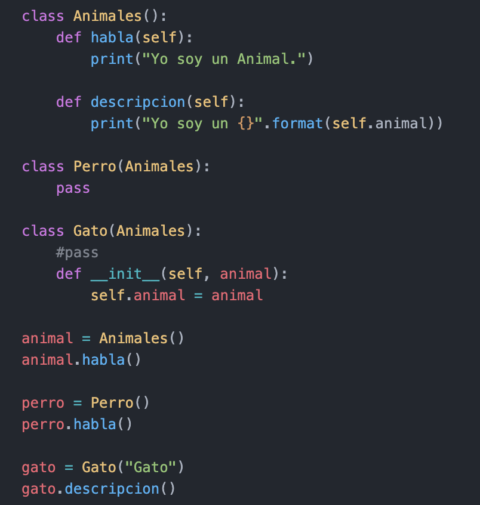

# Herencia
### La ***herencia*** es el fenómeno que se da cuando una clase superior, por ejemplo ***"Animal"***, le comparte sus atributos y métodos a una clase derivada, por ejemplo ***"perro"***, si necesidad de que esta ultima clase defina todos los atributos y métodos nuevamente.

### La clase derivada hereda características de la clase base donde se puede agregar nuevas características, Esto da como resultado la reutilización del código.

### Salida:

- Yo soy un Animal.
- Yo soy un Animal.
- Yo soy un Gato

#
|  | Descripción |
|-----:|---------------|
|  | ***Documentación oficial*** |
|  | ***Ejemplo*** |

## Puedes seguir y apoyar mi trabajo haciendo click en "☆ Star" y en el botón de Follow.
## ¡Muchas gracias, bienvenido!!!

## Contacto y apoyo:

 
 

