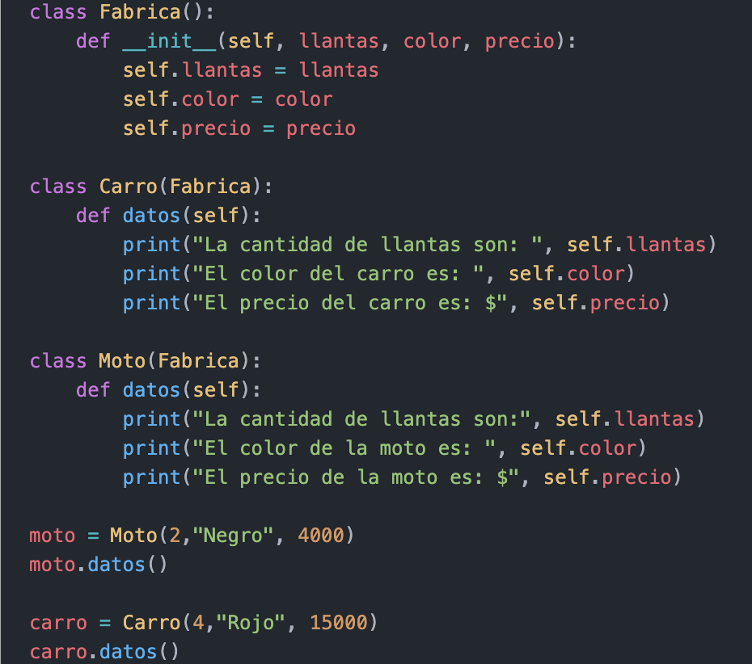

# ***Ejercicio 3***
### Crear una clase Fabrica que tenga los atributos de Llantas, Color y Precio; luego crear dos clases mas que hereden de Fabrica, las cuales son Moto y Carro. Crear métodos que muestren la cantidad de llantas, color y precio de ambos transportes. Por ultimo, crear objetos para cada clase y mostrar por pantalla los atributos de cada uno.

### Salida:
- La cantidad de llantas son: 2
- El color de la moto es:  Negro
- El precio de la moto es: $ 4000
- La cantidad de llantas son:  4
- El color del carro es:  Rojo
- El precio del carro es: $ 15000

#
|  | Descripción |
|-----:|---------------|
|  | ***Documentación oficial*** |
|  | ***Ejemplo*** |

## Puedes seguir y apoyar mi trabajo haciendo click en "☆ Star" y en el botón de Follow.
## ¡Muchas gracias, bienvenido!!!

## Contacto y apoyo:

 
 

