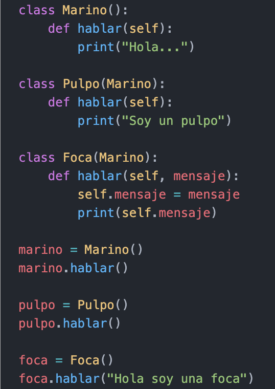

# Ejercicio 4

### Crear una clase llamada Marino(), con un método que sea hablar, en donde muestre un mensaje que diga "Hola...". Luego, crear una clase Pulpo() que herede Marino, pero modificar el mensaje de hablar por "Soy un Pulpo". Por ultimo, crear una clase Foca(), heredada de Marino, pero que tenga un atributo nuevo llamado mensaje y que muestre ese mensaje como parámetro

### Salida:

- Hola...
- Soy un pulpo
- Hola soy una foca

#
|  | Descripción |
|-----:|---------------|
|  | ***Documentación oficial*** |
|  | ***Ejemplo*** |

## Puedes seguir y apoyar mi trabajo haciendo click en "☆ Star" y en el botón de Follow.
## ¡Muchas gracias, bienvenido!!!

## Contacto y apoyo:

 
 

